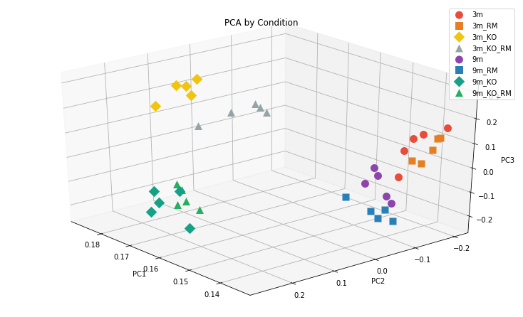

GeneExpressionPCA [](https://www.paypal.com/cgi-bin/webscr?cmd=_s-xclick&hosted_button_id=EFQXNQ7UYXYKW&source=url)
=======

[GeneExpressionPCA](https://github.com/thierrygrimm/GeneExpressionPCA) is a Principal Component Analysis of Gene Expression data.  Check the rules for further details.

## Biochemical Foundations
The signaling pathway regulating the activity of the mammalian ```target of rapamycin complex 1 (mTORC1)``` controls skeletal muscle homeostasis, which is determined by the difference in the rates of protein synthesis and degradation. 
In the skeletal muscle, mTORC1 activation occurs in response to a variety of signals, including growth factors, nutrients, energy state and mechanical load. 
To study the function of mTORC1 in the skeletal muscle, the laboratory of Dr. Markus Rüegg (Biozentrum) has developed a ```mouse model called TSCmKO```, in which the ```TORC1 inhibitor Tsc1 was selectively deleted``` in skeletal muscles. 
It was found that these mice develop precocious sarcopenia, characterized by fragmentation of the neuromuscular junction, progressive loss of muscle mass and loss of muscle force. 

<p align="center">
  
</p>

Treatment of TSCmKO mice with ```rapamycin```, an mTORC1 inhibitor, ameliorated the myopathy. 
To identify core pathways that underlie myopathy in TSCmKO mice, ```mRNA-seq samples``` from EDL muscle of TSCmKO mice and wild-type mice of the age of 3 months (young phase in both TSCmKO and wild-type mice) and 9 months (adult phase in wild-type mice and sarcopenic phase in TSCmKO mice) in combination with rapamycin treatment were generated and sequenced at the Quantitative Genomics facility of the Biozentrum.


## Conditions
The table called “GeneExpressionTable.tsv” contains the information about the expression of 117 genes in log2[TPM] units measured in the Musculus extensor digitorum longus of the following mice:


* Condition 1: 5 replicates of 3 months old wild-type mice
* Condition 2: 5 replicates of 3 months old wild-type mice treated with rapamycin
* Condition 3: 5 replicates of 3 months old TSCmKO mice
* Condition 4: 5 replicates of 3 months old TSCmKO mice treated with rapamycin
* Condition 5: 5 replicates of 9 months old wild-type mice
* Condition 6: 5 replicates of 9 months old wild-type mice treated with rapamycin
* Condition 7: 5 replicates of 9 months old TSCmKO mice
* Condition 8: 5 replicates of 9 months old TSCmKO mice treated with rapamycin

## Principal Component Analysis



The PCA was performed in both directions (conditions and genes). The first three Principal Components were examined and the variance explained by it was calulated.
The replicates were clustered with a k-means algorithm according to their expression levels.

## Issues

Found a bug? Want more features? Find something missing in the documentation? Let us know! Please don't hesitate to [file an issue](https://github.com/thierrygrimm/GeneExpressionPCA/issues/new) and make a recommendation.

## License
```
GeneExpressionPCA - Principal Component Analysis of Gene Expression data

The MIT License (MIT)

Copyright (c) 2019 Thierry Grimm

Permission is hereby granted, free of charge, to any person obtaining a copy
of this software ("GeneExpressionPCA") and associated documentation files (the "Software"), to deal
in the Software without restriction, including without limitation the rights
to use, copy, modify, merge, publish, distribute, sublicense, and/or sell
copies of the Software, and to permit persons to whom the Software is
furnished to do so, subject to the following conditions:

The above copyright notice and this permission notice shall be included in
all copies or substantial portions of the Software.

THE SOFTWARE IS PROVIDED "AS IS", WITHOUT WARRANTY OF ANY KIND, EXPRESS OR
IMPLIED, INCLUDING BUT NOT LIMITED TO THE WARRANTIES OF MERCHANTABILITY,
FITNESS FOR A PARTICULAR PURPOSE AND NONINFRINGEMENT. IN NO EVENT SHALL THE
AUTHORS OR COPYRIGHT HOLDERS BE LIABLE FOR ANY CLAIM, DAMAGES OR OTHER
LIABILITY, WHETHER IN AN ACTION OF CONTRACT, TORT OR OTHERWISE, ARISING FROM,
OUT OF OR IN CONNECTION WITH THE SOFTWARE OR THE USE OR OTHER DEALINGS IN
THE SOFTWARE.
```me
